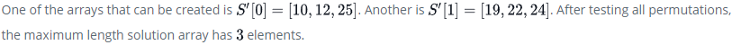

# Non-Divisible-Subset
Given a set of distinct integers, print the size of a maximal subset of **S** where the sum of any **2** numbers in **S** is not evenly divisible by **k**.

# Example
```
S = [19,10,12,10,24,25,22]
k = 4
```



## Function Description

Complete the nonDivisibleSubset function.

nonDivisibleSubset has the following parameter(s):

* int S[n]: an array of integers
* int k: the divisor

## Returns

int: the length of the longest subset of  meeting the criteria

## Sample Input
```
S = [1, 7, 2, 4]
k = 3
```
## Sample Output
```
3
```

## Explanation

The sums of all permutations of two elements from **S** are:
```
1 + 7 = 8
1 + 2 = 3
1 + 4 = 5
7 + 2 = 9
7 + 4 = 11
2 + 4 = 6
```

Only **S = {1,7,4}** will not ever sum to a multiple of **k = 3**.
